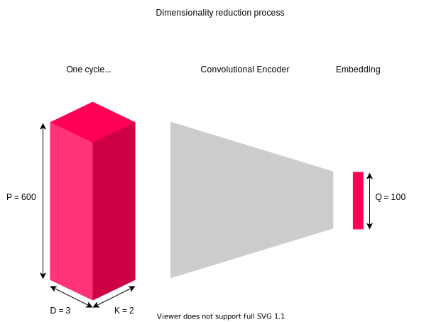

# Abstract

The paper Cyclic Arbitrage in Decentralized Exchange Markets[[1]](https://arxiv.org/abs/2105.02784) showed a large number of occurrences of cyclic arbitrages in decentralised exchanges compared to centralised ones. In their work, they mainly focus on analysing these cycles in terms of length, token distribution, daily patens and profitability.

However, the factors driving their appearance have not been studied yet.  To this end, we propose to extend the work of [[1]](https://arxiv.org/abs/2105.02784) on Uniswap data. Moreover, we also plan to study the predictive power of these factors in a binary classification setting. It will allow determining whether or not a cycle can actually be implemented and generate a positive return, which has an inherent market value.

# Goal

The goal of this project is to study exploited cyclic arbitrage in decentralised exchanges. We already have access to the [Cyclic transaction dataset](https://disco.ethz.ch/misc/uniswap/cycles_in_Uniswap.json) which contains cyclic arbitrages that were exploited. We intend to extract features out of events (trade rates, trade volumes, liquidity) preceding the arbitrages. 

These features could potentially be high dimensional (depending on the length of the time series) and we will need to use dimensionality reduction techinques to create an embedding to build a relevant set of features of our future machine learning models.

Then, we will cluster the arbitrages based on the computed features. Ideally, we would like to observe meaningful clusterings: profitable cycles get clustered together, cycles having similar duration (how long it is profitable) also end up in the same cluster, etc. Once meaningful clusters are obtained, it gets interesting to use the same features in a prediction model having profitability of the arbitrage as a target.

# Data Acquisition

Data used in the study come from two different sources: information about exploited cycles comes from the dataset used in the arxiv paper. Data concerning rates preceding the cycles come are from through bitquery.

## Dataset from the paper

We already have downloaded the dataset used in the arxiv paper. This dataset consists of arbitrage cycles that were exploited in the past. Each of these cycles is described by a path (the token swaps),  a cost (gas fees), a profit, etc.  It consists of a single JSON file and the downloading process is straightforward. The `cyclic transaction dataset` contains cycles of various lengths (number of tokens involved). The following figure displays the distribution of these lengths : 



> Note: this figure was replicated from the arxiv paper.

Moreover, to compute the embedding (next step) it would be more convenient to work on fixed-length cycles. Thus, cycles whose lengths are different than 3 are filtered out. The obtained data is called `filtered_cycles_data`.
While filtering, a new indexing system is created to identify cycles through an incremental  `cycle_id`.

## Custom extended dataset (Uniswap data)

As a second step, we construct an extended version of the `cyclic transaction dataset` as follows. For each cycle in `filtered_cycles_data`: 

1. We fetch from [https://bitquery.io/](https://bitquery.io/) the exchange rates and gas prices of the   `k` preceding the swaps present in the cycle path. This downloading process is more complex and needs to address some challenges. The free version of the `bitquery API` that is used for this project only allows a limited number of queries (10/min). To solve this issue we used EPFL's cluster machine to query the API for a few weeks with a time delay between each call. To increase the throughput we used 2 API keys. For each given cycle in `filtered_cycles_data` 3 calls are needed, one per edge of the cycle. 
2. The fetched data is saved in multiple JSON files named `uniswap_raw_data_start_end` where `start` and `end` designate the starting and ending `cycle_id` of cycles included in the file. We chose to use multiple files to avoid big losses in case of failure, these files are copied in safe storage as a backup. The files are then combined into a single pandas DataFrame named  `uniswap_data.csv`. We posted the dataset (splited files) on [Kaggle](https://www.kaggle.com/ogst68/uniswap-rates-preceeding-cyclic-arbitrages-raw/download)

Each row contains information about a single swap :

>  `cycle_id`, `token1`, `token2`, `baseAmount`, `quoteAmount`,`quotePrice`, `gasPrice`, `gasValue`, `time`.

In the following section, we will only work on this extended dataset which is therefore referred to as `the dataset`. 


# Data Wrangling 
## Data Exploration

Before developing any machine learning model, we need to grasp a basic understanding of the `dataset` and its statistical properties. 

As a first step, some basic descriptive statistics are shown.

||baseAmount|quoteAmount|quotePrice|gasPrice|gasValue|
|---|---|---|---|---|---|
|count|15000000.0|15000000.0|15000000.0|15000000.0|15000000.0|
|mean|617285.7691774105|713846.7959430087|2242173912899.245|220.7801204099542|0.039095987647290976|
|std|65344245.49678698|70486989.66812174|1692048320610068.8|358.3729580470268|0.07014017303962658|
|min|-15.142535104|-12.159705765907386|-2524.8558484026958|4.0|0.000995174389907456|
|25%|0.8133318661470393|0.9036593505321668|0.004853244571226323|38.999998464|0.0077283002647838715|
|50%|12.397615|13.492995324544614|1.00714360456757|112.99999744|0.017265654713286657|
|75%|452.1615419051607|437.5007715050853|210.47100813227757|337.500012544|0.05276144843830067|
|max|38617566009.5172|38617566009.5172|2.8893209691893514e+18|100000.00037683199|13.081600120162616|

Since we are dealing with financial time series for the following features:

> `baseAmount`, `quoteAmount`,`quotePrice`, `gasPrice`, `gasValue`

We will probably observe heavy tail distribution to some extent. It is what we are going to check first.

> Note: in this section, no distinction is made between cycles. In other words, all data available is treated as a single feature, aka a single distribution. Indeed, understanding each cycle separately is a cumbersome process. Furthermore, it does not help in getting a global understanding of the dataset.

Note that only `quotePrice` and `gasPrice` are used as features for the embedding (in fact `quotePrice = quoteAmount/baseAmount` ). The distribution of `quotePrice` is shown below:



We observe that both features are extremely heavy tailed. It is likely to cause some issues when used as features for machine learning models. As shown in the plot,applying a logarithmic transformation make the distributions more Gaussian (desired behaviour).

As a result, we computed again the basic descriptive statistics but this time in a log scale. We observe a better scale and the results are much more interpretable.

||baseAmount|quoteAmount|quotePrice|gasPrice|gasValue|
|---|---|---|---|---|---|
|count|14999899.00|14999852.00|14999751.00|15000000.00|15000000.00|
|mean|2.91|2.95|0.04|4.74|-3.94|
|std|4.02|3.99|5.70|1.17|1.17|
|min|-41.45|-41.45|-40.91|1.39|-6.91|
|25%|-0.21|-0.10|-5.33|3.66|-4.86|
|50%|2.52|2.60|0.01|4.73|-4.06|
|75%|6.11|6.08|5.35|5.82|-2.94|
|max|24.38|24.38|42.51|11.51|2.57|

We also would like to draw the readers attention of the fact that this global heavy tail phenonom also appears at the token pair scale. However, we observe more variability in the distributions. We took a liquid token pool (lots of transactions within a small time frame) to compute the following graph.



Furthermore, some tokens were partially illiquid which negatively affects the number of transactions available in the dataset. To better understand this phenomenon, we plotted the distrbution of transaction per token pair.



Futhermore, it is likely that for illiquid uniswap pools the time between the first and the last transactions reported differ quite significantly. In contrast, for very liquids pools, the time-span can be in the order of miliseconds. This discrepancy in the dataset could create some issues for the analysis performed in this study.

We provide more detail information of the time-span distribution in the following plot.



A large disparity is observed with respect to the time span distribution. Furthermore, some transactions have more than 100 days gap for the same token which characterise the illiquity of the underlying tokens. However, the observed median time span is still fairly reasonable : `1 days 21:52:20`.

After a quick data exploration on these illiquid tokens, we realised they have a very different feature distribution than the other. They can be considered as outliers and therefore negatively impact the training of our machine learning tasks. Futhermore, one might argue that abitrage on illiquid tokens are hard to realise in practice and they there less incentive in studying them.

At this stage, we propose develop two sub-datasets for the rest of the tasks, one qualified as `full` since it contains all cycles and another qualified as `liquid` containing only those that are considered liquid enough, meaning that they satisfy the following conditions:

1. Each token in the cycle has at least half of transactions that should have been fetched (i.e. 300 out of 600). 
2. Each token in the cycle is in the `80%` quantile of the time-span distribution defined above (i.e. span less than 15 days).

As we will later see, the `full dataset` is harder to train and we decided to only use the `liquid` at some point. 

## Data preprocessing

As it was previously said, the focus of this study is on cycles of length 3. We propose to model each cycle as a list of 3 nodes which are themselves represented as 2-dimensional time series: `quote prices` and `gas prices`. These time series have length at most `P = 600` (transaction data fetched from `bitquery`).

### Logarithmic transformation

As shown in section [Data Exploration](#data-exploration), it is probably a good idea to apply the `element-wise logarithm` to the `quotePrice` and `gasPrice` features as a first step.

### Train/Test split

In order to test our models with the least amount of bias possible, we randomly split the datasets into a training and testing set (`20%`). 
### Scaling the features

To avoid the effect of the scales of the features in our results we have to re-scale them. To do so, we can consider two different approaches:

* Use a standard scaler that applies the following transformation to each feature $$x_i$$ :
        $$x_i=\frac{x_i-\bar{x_i}}{std(x_i)}$$
  By doing so we obtain a dataset with zero mean and a variance of 1 
* Use a min max scaler that reduce the range fo the features to [0,1] by applying the following transformation to each feature $$x_i$$ :
         $$x_i=\frac{x_i-min(x_i)}{max(x_i)-min(x_i)}$$

After taken the `log` global features showed in the data exploration section somhow look Gaussian. Hence, we decided to opt for the standard scaler.

Moreover, token pairs can have very different scales in terms of quote and gas prices. Therefore, it might be worthy to define a custom scaling mecanism for each of these pairs. We refer to this as a `TokenStandardScaler` in the code.

As expected, the latter approach yields better performance in the following machine learning tasks. However, it requires more processing power than the first approach. We had to restrict the number of rows in the dataset to be able to leverage it.

### Zero-Padding

In this study, each cycle is represented as a tensor with the following 3 dimensions:

| Name | Size |  Description                                                           |
|:----:|-----:|:-----------------------------------------------------------------------|
| `D`  | 3    | the length of the cycle, aka the number of tokens                      |
| `P`  | 600  | the length of the time series of swap transactions                     |
| `K`  | 2    | the amount of time series/features (`quotePrice` and `gasPrice`)       |

However, due to lack of liquidity in Uniswap pools for a given pair of tokens, there could be less than `P = 600` swap transaction fetched from `bitquery`.  Since machine learning models required to fix the input size for their functioning, we need to pad the shorter time series. To this end, the fixed length `P =600` was chosen, as well as the `zero-padding` technique for simplicity reasons. An extensive backtesting process could be performed later on (e.g. fixed or mean frequency between two cycles). However, due to time constrains, we decided not to explore further in this direction.

>  Note: in both train and test splits the `zero-padding` artictial values account for roughly `17-18%` of the `full` data set. In the [further steps section](#further-steps), we propose alternative to reduce this overhead.

### Building the feature tensor

`The dataset` is not directly shaped to build the tensor feature for the machine learning models. Indeed it simply contains a list of swap transactions in `csv` format. We need to massage using with multiple operations to group transactions associated to the same cycle together and pad each time series independently. 

> Note: hardware capacities of the cluster only allowed us to process `10 000 000` swap transactions.

# Cycle embedding 

## Movitation

In section [Data preprocessing](#data-preprocessing), we modelled each cycle by a `D x P x K = 3 x 600 x 2` tensor. Hence, each of them is represented by `3600` parameters. 

However, one could argue that `3600` is  a too high dimensional way of encoding cycles. Especially given the fact we are dealing with financial time series containing lots of noise. Building a latent representation of cycles in which distances are more effectively modelled which can be a great use in further studies. 

In fact, later on in this article, we are going to cluster cycles using the `KMeans` algorithm which heavily relies on meaningful Euclidian distances computation which can make great use of a dimensionality reduction.

To create this embedding, multiple approaches can be considered. We propose the following:

1. [Principal component analysis (PCA)](https://en.wikipedia.org/wiki/Principal_component_analysis) 
2. [Autoencoder](https://en.wikipedia.org/wiki/Autoencoder) 

`PCA` is referred to in the literature as a simple linear projection operation. We plan to use it as a baseline comparison with the more complex `autoencoder` model.

The task of an autencoder is summarised in the following figure.

<p align="center">  </p>

The dimension of the latent  dimension `Q` determines the reduction factor optained through this process. 

> For example : with `Q = 100`, the eduction factor is `3600/100 = 36x` which is non-negligible.

However, the more we lower `Q`, the more the signal is compressed which increases the amount of error in the decoding phase. 

Using the `PCA` approach, we can easily understand how much is lost when `Q` varies.



In the [Cycles profitability prediction](#cycles-profitability-prediction) task, we will be able to measure the gain of the embedding compared to the raw features (base model).

## Autoencoder : different architectures
In this section, we tried multiple models (mainly focusing on autoencoders) for embedding computation through dimensionality reduction. As a first step, we trained the described models on the entire dataset that we have. However, we realized that some data points of the set were not `liquid` at all. These data points were represented by rates spanning over hundreds of days. The models performed poorly on this set so we decided to focus on `liquid` data only (see Data exploration). Multiple optimizers  (`Adam`,`SGD`,`NAdam`,`Adamax`,`RSMprop`) were tested for training. It appears that `Adamax` is the one working the best on these tasks. It was not always the case (no free lunch theorem) but `Adamax` was faster than the other optimizers by a factor of 10 when working on the `liquid` data.  

### PCA 
The first model chosen for embedding representation is a PCA having a latent space of 100 dimensions. note that `dim=100` will be used for all next models. PCA only considers linear transformations. However, it is fast to train (around 30s in our case) and can act as a baseline comparison for other models.

### Linear autoencoder 

Secondly, we trained an autoencoder with linear activations only. The purpose of this choice is to compare the autoencoder architecture with the PCA. Indeed, when using linear activations on all layers of the model, it should perform similarly to PCA. Thus, we expect the performances of this model to be comparable with the ones of PCA. 
The model consists of 3 fully connected linear layers, one of them being the bottleneck (`dim=100`). 
It is trained using Stochastic gradient descent and the following losses are obtained :


### Multilayer autoencoder

Let's go deep! In this section, the number of layers is increased and activation functions are changed to be non-linear(`elu`,`relu`,`selu`...). 
The neural network used here has 2 fully connected layers of 600 neurons each. They are symmetric to the bottleneck layer and uses `elu` activations.
Multiple activation functions were tested on this architecture and `elu` was retained to be the best one (based on test MSE). 
This model is named `fully_connected_3L` and the obtained losses are :


Surprisingly, the best loss obtained by this complex model does not beat the PCA model. It is the reason why training goes up to `500 epochs`. We wanted to see how the loss behaves and if it drops later on. But it did not happen. This model has the same number of layers as the `linear` one but it has mode neurons and the activations are more complex. Since the model is more complex we expect it to outperform the  `linear`  and `PCA` models on the training loss.  
Note that more variants of neural network architectures will be trained and tested later on using the `Talos` library.

### Convolutional autoencoder

To better capture the structure of cycles, we propose an alternative to the fully dense model of the previous section: a convolutional `autoencoder`. The motivation to introduce this complex architecture is that when a cyclic arbitrage is implemented, the first transaction could affect some price/gas of the second token and similarly for other transactions. The convolution operations could extract these neighbouring relationships between tokens to build a better latent representation of cycles.
We hope that a convolutional layer will allow us to leverage this structural bias.
First, we tried to train a "simple" CNN but it did not perform well. CNN are a simpler model than fully connected networks, having a limited number of parameters that are shared might cause some bias in the prediction. So we decided to add complexity to this model :  
In addition to the convolutional layers of the network, we added 2 dense layers of 300 neurons symmetrically connected to the bottleneck. 

Formally, we used the following architecture :

```python
def CNN_fully_connected():
    model_name = "CNN_fully_connected"
    # build encoder
    input_img = keras.Input(shape=(3,600, 2))
    x = layers.Conv2D(8, (3, 3), activation='relu', padding='same')(input_img)
    x = layers.MaxPooling2D((1, 2), padding='same')(x)
    x = layers.Conv2D(4, (3, 3), activation='relu', padding='same')(x)
    x = layers.MaxPooling2D((3, 1), padding='same')(x)
    encoded = layers.Conv2D(1, (1, 2), activation='relu', padding='same')(x)
    # Dense layers
    x = layers.Dense(300,  activation='elu')(x)
    encoded = layers.Dense(100,  activation='elu')(x)
    x = layers.Dense(100,  activation='elu')(encoded)
    x = layers.Dense(300,  activation='elu')(x)
    # build decoder
    x = layers.Conv2D(4, (1, 2), activation='relu', padding='same')(x)
    x = layers.UpSampling2D((3, 1))(x)
    x = layers.Conv2D(8, (3, 3), activation='relu', padding='same')(x)
    x = layers.UpSampling2D((1, 2))(x)
    decoded = layers.Conv2D(2, (3, 3), activation='relu', padding='same')(x)
    # combine encoder and decoder
    autoencoder = keras.Model(input_img, decoded)
    autoencoder.compile(optimizer='adam', loss='mean_squared_error',)
    return model_name, autoencoder
```
This model is named `CNN_fully_connected` and produces following losses : 


## Performance Analysis
The following figure illustrates the losses obtained by each described model : 


As expected, the linear model's performances are close to the ones of PCA. However, the results obtained for more complex models do not meet our expectations. The fully connected network and the CNN perform poorly compare to PCA. They should perform better on the training data at least because they are more flexible. PCA is restrained to linear transformations which is not the case for CNN and  `fully_connected_3L`. 
This poor performance might come from the choice of the network architecture: number of layers/neurons, activation functions...
To find the optimal architecture we tune these parameters in the following section.


## Hyper-parameter optimisation

Now that we selected our main architecture for our autoencoder, namely a fully connected MLP, let's optimise our loss. They are multiple hyperparameters that can be tune for this model. We selected the following : 

| Parameter name                   | Option 1 | Option 2 | Option 3 | 
|:---------------------------------|---------:|---------:|---------:|
| `activation function`            | `selu`   | `elu`    |          |
| `# dense layers`                 | `1`      | `2`      |   `5`    |
| `# neurons in first/last layer ` | `200`    | `300`    |   `500`  |
| `dropout factor`                 | `0%`     | `25%`    |   `50%`  |
| `optimizer`                      | `adam`   | `nadam`  |          |
| `# epochs`                       | `20`     | `100`    |   `160`  |

In order preform this best parameter search, we used the `Talos` python library which makes it fairly easy to test hundreds of parameter combinaisons in a few lines of code. 

After running not less than `XXXXXXXXXXXXXXXXXXX` hours on the IZAR EPFL cluster, we got the following results: 

XXXX

Note that `Talos` does not support `K-fold` cross-validation yet, so we had to use a single validation set (`20%`) for this task. 

# Cycles profitability prediction

## Motivation

The goal of the project also consists of testing the predictability of the cycle's profitability. The return of a given cycle is defined by its `revenues` minus its `cost` (fees). `Profitability` is a Boolean value indicating if the corresponding cycle has positive or negative `profitability`. `Profitability` is then used as a target/label for classification tasks. 94% of the cycles have a positive return. This imbalance can badly affect the training process: The models will tend to always output true and will obtain a precision of 94% despite being meaningless.  Thus, we need to take this imbalance into the prediction process. The target imbalance is handled through the `class_weight` module of  Sklearn . It reweights the samples during training to obtain a 1:1 balance between positive and negative data points. 

## Features

Two different features are used as input for prediction : 
* `Embeddings`  : At first, the models use embeddings produced by the autoencoder as features. 
* `Embeddings + tokens` : Then, additional features are added : for each cycles we add to  its embedding an encoding (one hot) of the tokens it involves. 
 
These two types of featuere are used and scores are compared to see if names of involved tokens bring relevant information to the prediction. 

In our initial dataset, we also have access to the names of the 3 tokens particpating in the cyclic arbitrage, which could potentially be used as extra features ! 

However, machine learning models usually don't like strings features. Let's tokenize them !

Since we are dealing with a fixed (categorical) set of non-ordered features, a `one-hot` encoding is probaly a good way to go. 

For instance, imagine we only have 3 tokens in our dataset : 

> `ETH`, `DAI` and `AAVE`

Then one could use the following `one-hot` encoding to represent them. We have 3 tokens so the encoding will be 3-dimensional 

| Token Name | \| | Dim 1 | Dim 2 | Dim 3  |
|:----------:|:--:|:-----:|:-----:|:------:|
| `ETH`      | \| |  1    |   0   |   0    |
| `DAI`      | \| |  0    |   1   |   0    |
| `AAVE`     | \| |  0    |   0   |   1    |


For a linear algebra persective, we observe that all rows have the same norm and are linearly independent, this is what makes this `one-hot` encoding a excellent choice for our purposes.

We draw the attention of the reader on the fact that these extra features should not be added as input to the convolutional autoencoder. Indeed, there is not translation bias to exploit here. In order to ease the performance comparision with other types of embedding model, we decided not to use them in any of the embedding related tasks.

However,  the profitability prediction. 

## Different models

First, simple models such as logistic regression and SVM are used. These models take the previously computed embeddings as features. Then a more complex model consisting of a neural network is used, it is fed with the raw features. Namely, the swap rates and gas fees.

### Logistic regression
The first model consists of logistic regression. It is fitted on the standardized embeddings using a grid search cross-validation process to tune the hyperparameter C (regularizer). The following confusion matrices (one per type of features) are obtained on the test set : 


`Embeddings` confusion matrix :
| /           |True(pred) | False(pred) |
|------------:|:---------:|:------------|
| True(real)  | 2241      |   1544      |
| False(real) |  104      |   112       |

`Embeddings + tokens` confusion matrix :
| /           |True(pred) | False(pred) |
|------------:|:---------:|:------------|
| True(real)  | 2241      |   1544      |
| False(real) |  104      |   112       |

Corresponding f1 scores : 
| /           |`Embeddings ` | `Embeddings + tokens`|
|------------:|:------------:|:---------------------|
| f1 score    | 0.7312       |   1544      |


### Support vector machine (SVM)
The second model is a support vector machine trained on the standardized embeddings to find the optimal boundary between profitable and non-profitable cycles. Again, cross-validation is used to tune the hyperparameters. Namely: the kernel of the SVM (`linear`, `rbf`, or `poly`) and the regularizer (`C`). The selected model produces the following confusion matrix on the test set : 


`Embeddings` confusion matrix :
| /           |True(pred) | False(pred) |
|------------:|:---------:|:------------|
| True(real)  | 2241      |   1544      |
| False(real) |  104      |   112       |

`Embeddings + tokens` confusion matrix :
| /           |True(pred) | False(pred) |
|------------:|:---------:|:------------|
| True(real)  | 2241      |   1544      |
| False(real) |  104      |   112       |

Corresponding f1 scores : 
| /           |`Embeddings ` | `Embeddings + tokens`|
|------------:|:------------:|:---------------------|
| f1 score    | 0.7312       |   1544      |


## Investigation of the different embeddings performance 


### PCA 

True neg : 20 | False pos : 34 | False neg : 373 | True pos : 814
╒══════════════╤═══════════════╤═════════════════╕
│ \            │   True (pred) │    False (pred) │
╞══════════════╪═══════════════╪═════════════════╡
│ True (real)  │           814 │             373 │
├──────────────┼───────────────┼─────────────────┤
│ False (Real) │            34 │              20 │


# Cycle clustering

## Motivation and method

Cycles clustering can be understood as an unsupervised method to classify cycles into a given (`k`) number of categories. The clustering assignments provide a natural way of grouping cycles together. Statistical analysis can be conducted on the clusters to understand the general structural properties of the dataset. 

To this end, we will start by studying the output of a standard clustering algorithm named [K-means](https://en.wikipedia.org/wiki/K-means_clustering).

The starting point of the analysis is to understand which values of ```k``` (the number of clusters) lead to a relevant clustering assignment. ```silhouette``` and ```sse``` plots are the standard way to go.  



Usually, we should observe a maximum spike in the silhouette method plot. This is not the case here. The curve has a clear growing trend but there is no clear reason, at least for our analysis, why we should go above 20 clusters. Hence the silhouette plot is not particularly useful in the task of choosing the best `k`.

However, the elbow method applied on the SSE graph seems to indicate that the steepest slope is in the range $[0, 20]$. For $k > 20$ there is less evidence than, increasing `k` improves the quality of the clustering.

Individual area silhoutte scores are also worth looking at. They can found in the next plot, sorted and grouped by clusters for convinence.

Since the elbow method did not allowed us to exclude any values of `k` before 20, we choose a some values for which there was a spike in the silhouette score (indicating that there was a jump in clustering performance). 

Therefore, we believe that `k=5, 7, 13, 19` may be fair tradeoffs between the goodness of the fit and the number of clusters. In the following plot, we will investigate the quality of the individual cluster to choose our final value.

{:class="img-responsive"}


## Clustering validation

In this section, we aim to provide the reader with evidence that the clustering contains useful information (aka clustering assignments are neither random nor trivial, all cluster are in the same cluster). 

In other words, using relevant metrics, we need to demonstrate dissimilarities across clusters that are also persistent on the `test set`. 

For instance, we could consider the following :

1. `Number of cycles per cluster` : a sanity check to understand the overall quality of the clustering. Indeed, if `99%` of cycles are clustered together, we won't be able to extract meaningful information out of the clustering.
2. `Profit per cluster` : we would expect to observe clusters more profitable than others 
3. `Profitibility per cluster` : this metric is related to the risk associated to a cluster. Indeed, some clusters could be less profitable than others (in average) but yielding a higher probability to make a profit in the end. It s the type of analysis that we would like to conduct with this metric. 
4. `Token distribution understanding per cluster` : one desirable property of an interesting clustering could be to observe important differences in terms of token distribution across clusters. For example, computing the  `median` of the distribution would allow us to understand whether or not only a few tokens that are very profitable or not are used. Furthermore, the entropy of the distribution can be used as a comparison to a random clustering. 

These metrics, computed on the training set, are shown below.











At first sight, it already looks quite promising. Let's dive into the details:

1. Cluster `0` appears to be the one generating the larger amount of profits, with slightly better profitability but nothing astonishing.
2. On the contrary, cluster `1` is below average in terms of profits.
3. There is no outstanding differences in terms of profitability across clusters. However, one should note that the global average is already at `95%` which shows that most of the cycles are profitable anyway.
4. Cluster `0` contains more data points than the others. When it comes to the token distribution, it is more random than the rest (see large entropy and low median), perhaps a catch-all cluster ?
5. Cluster `3` has a very large median and low entropy for its token distribution. It is also the second most profitable cluster. We can understand that it is likely to always use the same tokens to generate high returns. Given the fact that it contains a relatively small number of tokens, we should definitely investigate it further.

In the following set of plots, the same metrics are recomputed but this time on the test set. Interestingly, the conclusions that were drawn for the train set can be extended for the test, demonstrating some degree of predictability/persistence.











# Conclusion

XXXXXXX

# Further steps 

We concluded the project, but there is still lots of opportunities for improvement. Some of them are described below.

## Embedding improvement 

### Attention Learning 

In section [Data preprocessing](#data-preprocessing), `0-padding` was introduced to standardise the length of each time series. However, the choice of `0s` is rather arbitrary and can introduce many problems upon training the `autoencoder` (as well as scaling the data). Indeed, a small computation shows that introducing this padding technique adds `7 500 000 000` zeros which corresponds to a fraction `17%` of the training set entries. This means that the `autoencoder` can do a decent only by trying to improve the reconstruction of `0s`is the training set. 

Moreover, if we keep increasing the number of padded `Os`, we can make the `MSE` arbitrary close to 0 (perfect model). 

These undesired behaviours could be addressed by introducing a special token `PAD` which has no intrinsic value.

A classical way to solve this problem is to use attention learning as we have in Natural Language Processing tasks such as the `BERT Transformer` model. 

The idea is to define, for each data point, a mask containing 0 and 1 entries that specifies which part of the data point shall be considered valid by the Neural Network layers. This mask is therefore passed along each layer, until the final loss function which is only be evaluated for the valid (non-padded) entries. 

Keras offers two build-in constructs for [mask-generating layers](https://keras.io/guides/understanding_masking_and_padding/): `Embedding` and `Masking`. 

Using them would increase the quality of the embedding. However due to time constrains, we did not consider it in this study.

### Circular Convolutions

In the above sections, we defined a fairly complex convolutional architecture for the autoencoder. In the scheme, we use standard `zero-padded` convolutions. However, due to the cyclic nature of the arbitrages, a possible improvement would be use circular convolutions instead. However, since no default implementation in keras was available, a custom layer needs to defined. 

Since this process is time consuming and error-prone, we decided to stick with keras basic implementation but circular convolution is definitely a step that is worth exploring.

### In depth comparision

The performance of the encoder could be compared with more complex embedding techniques than `PCA` such as `Fourier/Wavelet transform` or `Signature transform`.

## Clustering improvement 

If we increase the quality of the embedding, the clustering quality should increase as well. However, we can further back test the clustering algorithm by comparing KMeans with BDscan for instance.

# Resources 

1. [Attention learning in Keras](https://keras.io/guides/understanding_masking_and_padding/)
2. [Selecting the number of clusters with silhouette analysis](https://scikit-learn.org/stable/auto_examples/cluster/plot_kmeans_silhouette_analysis.html)
